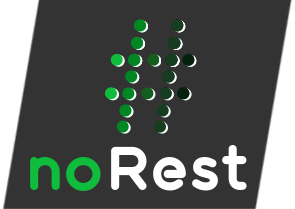

<p align="center">
  
  <br />
  <strong>A zeroconfig (not only) RESTfull API</strong>
</p>

# Getting started

Download the CLI via npm:
```
npm i -g @norest/cli
```

And start it by running the command
```
norest
```

The default port is `3030` and the base path is `api`. You can start by POSTing an fragment to that endpoint:
```
POST http://localhost:3030/api
{
  "name": "foo product",
  "price": 10,
  "#_product": {}
}
```

That product is then accessible via the endpoint `http://localhost:3030/api/product`.

# Idea
The idea behind noREST is as simple as the idea behind noSQL, it should provide data that is representational, but without the boundaries of fixed schema of the data. Therefore so called **index fragments** are added to the data itself, which allow the data to be requested, created and updated via the REST paradigm. Index fragments belongs to the data and can be added at any time (they start with `#_`).

As an example we will re-use the given product example from getting started. Imagine an E-Commerce API which holds thousands of products. After a while the project manager decides that they want to add featured products, that should be shown on the start page. Traditional some sort of link or flag would be introduced in the schema:
```
{
  "id": 1,
  "name": "bar product",
  "price": 10,
  "featured": true
}
```
In a traditional approach a new endpoint would be implemented and deployed and then the frontend engineers start using it. However with noREST a more **top-down** approach is possible by simply adding a new index fragment to each featured product:
```
PATCH /product/1
{
  "#_featured": {}
}
```
Afterwards all featured products can be requested with a simple GET request to the `featured` endpoint:
```
GET /featured
[{
  "id": 1,
  "name": "bar product",
  "price": 10,
  "#_featured": {},
  "#_product": {}
}]
```

The frontend engineers can start right away implementing that feature and align the back-office frontend (to allow adding the fragment) and the store front website to show the featured products. All **without any backend deployment**.

> The index fragment is called **index** fragment, as database connector automatically apply a index for fast resolving the data. Also the fragment is only visible if you are authenticated (read more about visibility in the Concept -> authentication chapter).

Now you might questioning, why that might be useful? The idea developed after one of that endless discussions about how an API should be shaped. The noREST paradigm tries to eliminate that discussion to speedup the develop process by using an top-down approach. The user interface can be designed first and the API schema can be shaped afterwards. 

Beside the development speed argument, noREST could be useful in other scenarios as well:
 - programs that needs flexibility as they consist of many different data structures (e.g. IoT applications)
 - JAM stack applications as private payloads can be used in server side rendering approach (See Concept -> Private and public payload)
 - headless system where the content creator is trusted and knows what it does

Overall it's an approach for data, where the data producer is trustable. It's not useful for REST endpoint that allow create, update and delete operations for non authenticated users.


# Concept
Following the core concepts of the noREST paradigm that allow to store and request data.

## Index fragment (`#_`)
An index fragment is a simple fragment that gets indexed on the database. At the same time it allows to request that data via the route. E.g. all entities of an index fragment called `#_product: {}` can be requested via `{{url}}/product`. 

## References (`@_`)
todo! 

## Private and public payload
By default all endpoints are readable. Sometimes you want to make data private. Therefore you can simply add it to the index fragment. The data inside the index fragment is only exposed if the user is authenticated (JWT is set) and authorized (read or owner rights of crudo). The following data can be seen by an authorized user:

```JSON
"#_product": {
  "overpriced": true
}
```


# Authentication and Authorization
Authentication is not handled by the API itself. Instead noREST just have two states: 
 1. unauthenticated: If no JWT is set you can read all endpoints
 2. authenticated: If a JWT is set you can CRUD all endpoints.

 The API just takes any JWT passed as cookie or authentication header and uses the `sub` as the current user. There is no validation done on the JWT. The API expects that it is valid and therefore the stack needs to ensure that it is validated. This can be done via a middleware, an API gateway or an service like Auth0.

## Authorization with CRUDO (todo)
To give certain users certain access to certain endpoints a `crudo` entry can be added to the JWT. The term `crudo` stands for **c**reate, **r**ead, **u**pdate, **d**elete and **o**wn. "Own" is a special kind which allows full access to entries you are owning. An example `crudo` entry looks the following:

```json
{
  "sub": "foo",
  "crudo": {
    "user": "o",
    "order": "cru",
  } 
}
```

Note:
 - By default any authenticated user has CRUD rights to all endpoints and you must opt-out to revoke the rights. So if there is another endpoint called products, the user foo is allow to create, read, update and delete items on this endpoint. It is a good stategy to change that strategy in the finalizing step of the API.
 - Read in this case allows to read even the private payload of a response (shown in the next).
